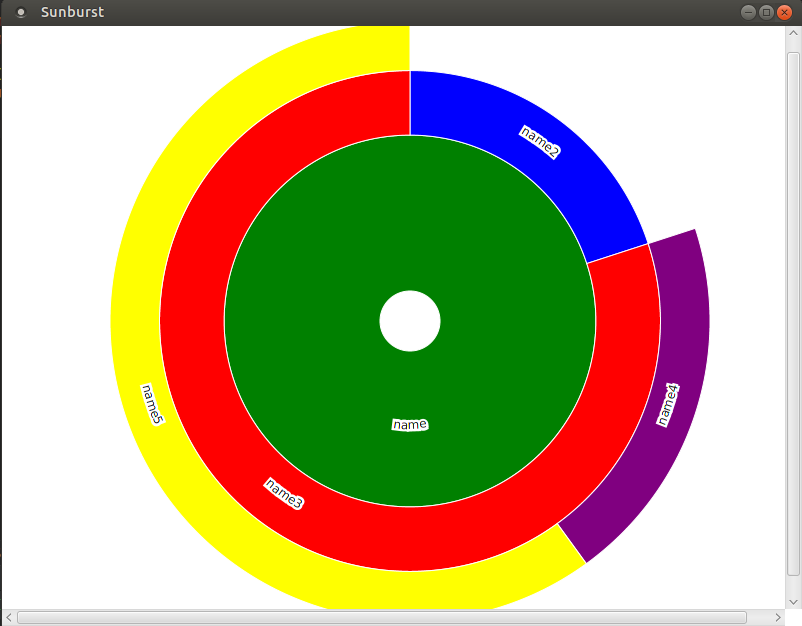

# JavaFXSunburst
Java application for displaying sunbursts diagrams. Relies on JavaFX and embedded Webview for displaying javascript code.

The library for managing the sunburst is not my work but: https://github.com/vasturiano/sunburst-chart

This is simply a facade for using it with maven.
### Slices
This app relies on the Slice class.
Each slice has a name, and a color that are mandatory.
Then a size, defining the size it'll have on the sunburst.
Finally an array of children.

In order to show a sunburst, simply call 
```$xslt
Sunburst.show(Slice s);
```   

### Example
Considering the following slice (JSON Format):

```json

{
    "name":"name",
    "color":"green",
    "children":
        [
            {
                "name":"name2",
                "color":"blue",
                "children":[],
                "size":1.0
            },
            {
                "name":"name3",
                "color":"red",
                "children": [
                                {
                                    "name":"name4",
                                    "color":"purple",
                                    "children":[],
                                    "size":1.0
                                },
                                {
                                    "name":"name5",
                                    "color":"yellow",
                                    "children":[],
                                    "size":3.0
                                }    
                            ]                
            }       
        ],
    "size":0.0
}
```

Calling the `Sunburst.show()` method using this JSON value would display in a separated JavaFX window the following sunburst:




___

Feel free to use this library.
Check this repo for more details : https://github.com/vasturiano/sunburst-chart
